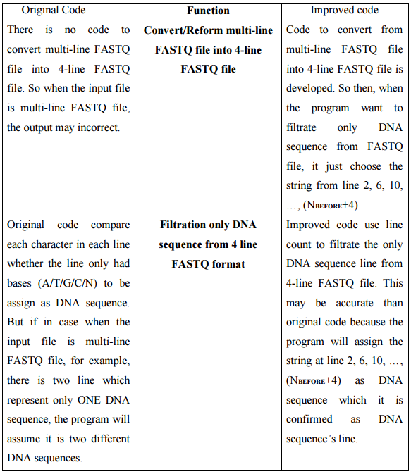

## Contents
1. Company
2. Project's Background
3. Project's Aim and Objectives
4. Term's Definition
5. Programming Language and Tools Used
6. Program's FLowchart
7. Method Implemented
8. Achievements
9. Demonstration
10. Conclusion

## Company
### Company Background
- Novocraft Technologies SDN BHD  

- Culmination of over 8 years of experience in software development and
performance tuning, bioinformatics research and high-performance computing.

## Company
### Company Background
- Mision
    - To be a globally recognized provider of innovative and accurate bioinformatics tools and services for
discovery, primarily in the next-generation genomics (NGS) space.
- Vision
    - Intelligent software that automates the complex data processing pipelines
required to conduct genomics analysis.
    - Ensuring better predictive power from NGS data in personalized genomics
& therapies.
    - Intelligent software that automates the complex data processing pipelines
required to conduct genomics analysis.

## Company
### Company Organization's Chart

## Company
### Company's Services and Product
- Services:
    - Bioinformatics Consultancy
    - Pipeline and Software Development Services
    - Bioinformatics Contract Research Services
- Products:
    - NovoSort
    - NovoAlignCS
    - NovoAlign
    - NovoWorx (Latest released tools)

## Project's Background
- Problem Statement:
    - Illumina Sequencing technology is a tool that used by the biologist/biological researcher to extract the genome sequence from any biological sample. However, the output from Illumina sequencing may contain sequences that are not originally found in the sample, but chemically synthesized, such as, the Adapter Sequence which is used to link the ends of two other DNA molecules. In order to get a clean genomic sequence, the adapter sequence needs to be identified and removed. A program has previously been developed in Novocraft to overcome this issue, Nevetherless, there are room for improvement in terms of the program's result accuracy and executional speed. 
- Project's Assigned:
    - To develop a program to find an adapter sequence from two paired-end FASTQ file (input file from user).
- Program's Name:
    - PEAdapterFinder program (__Pair Ends Adapter Finder__)
- Project's Initiator:
    - Rayan Gan, Internship Student in 2015

## Project's Aim and Objectives
- Project's Aim:
    - to develop program to find an adapter sequence from two paired-end FASTQ file (input file from user).

- Project's Objective:
    - To implement the code that can make the program’s result more accurate than before.
    - To implement the code that can increase the speed of program’s execution time.

## Term's Definition
- FASTQ File  
    - Line 1: Begins with a '@' character and is followed by a sequence identifier and an optional description (like a FASTA title line).
    - Line 2: Raw DNA sequence.
    - Line 3: Begins with a '+' character and is optionally followed by the same sequence identifier (and any description) again.  
    - Line 4: Encodes the quality values for the sequence in Line 2, and must contain the same number of symbols as letters in the sequence.  

## Term's Definition
### FASTQ File
- 4-Line FASTQ file example  

## Term's Definition
### FASTQ File
- Multi-line FASTQ file example  

## Term's Definition
- __Adapter Sequence__  
    - Adapter Sequence is a short, chemically synthesized, double stranded DNA
molecule. which is used to link the ends of two other DNA molecules.
- __Needleman-Wunsch Algorithm (NW)__  
    - NW is an algorithm used in bioinformatics to align two DNA sequences. 
- __Consensus Sequence (CS)__  
    - CS is used to find the highest frequency of DNA base(A/T/G/C) that need to be assign at certain place. 

## Programming Language and Tools Used
- Programming Language
    - C++ language
- Tools  

## Program's Flowchart
- Flowchart of PEAdapterFinder in finding adapter sequence.  

## Method Implemented
### Improved Code
- Accuracy  

## Method Implemented
### Improved Code
- Speed  

## Method Implemented
### Improved Code
- Speed  

## Achievements
### Result's Accuracy
- File Sample
    - Four-line FASTQ file: fourLine1.fastq & fourLine2.fastq
    - Multi-line FASTQ file: multiLine1.fastq & multiLine2.fastq

## Achievements
### Program's Speed 
- File Sample: sample1.fastq & sample2.fastq  

## Demonstration

## Conclusion
- Aim of this project had been achieved
- Objective of this project had been achieved

## Conclusion

## Conclusion

## Conclusion

